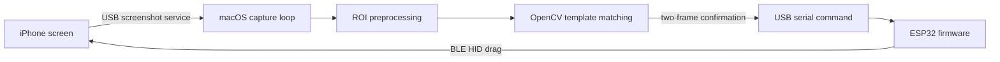

# Reels Ad Skipper

A hardware-assisted computer vision system that detects ads in Instagram Reels
on an iPhone and advances to the next video automatically.

The project combines macOS device services, a focused OpenCV pipeline, serial
communication, and custom ESP32 BLE HID firmware. Processing stays local: no
frames are uploaded, no cloud vision service is involved, and the solution does
not require modifying or jailbreaking the iPhone.

## Why I built it

This began as a small automation idea and became an exercise in making several
systems cooperate reliably across platform boundaries:

- acquire the iPhone screen without disrupting phone audio;
- distinguish a tiny UI label from arbitrary video backgrounds;
- translate a detection into an input gesture accepted by iOS; and
- make that gesture safe around interactive ads and the iPhone Home indicator.

The result is a working end-to-end prototype rather than a collection of
isolated scripts.

## System architecture



The Mac performs capture and detection. The ESP32 has one deliberately small
responsibility: expose a BLE mouse to iOS and execute a deterministic drag when
it receives `SWIPE` over serial.

## Engineering decisions

### Still screenshots instead of live mirroring

The first implementation consumed the iPhone's CoreMediaIO/AVFoundation video
stream. It provided smooth frames, but iOS also routed program audio to the Mac
while the stream was active.

The current implementation maintains a persistent connection to the iOS
developer screenshot service through `pymobiledevice3`. This supplies several
frames per second without opening a live media session, so audio and volume
controls remain on the phone. The original native Swift capture helper remains
in the repository as an alternative capture backend.

### Focused matching instead of general-purpose OCR

The detector does not need to understand a screenful of text; it needs to
recognise one short label in a known area. Each frame is resized to 450 x 970,
then only a 55 x 50 pixel region is processed.

Within that region the detector:

1. favours neutral white pixels and penalises colour-channel spread;
2. applies a morphological top-hat operation to isolate small bright features;
3. thresholds the result into a binary mask; and
4. compares it with calibrated label templates using normalised correlation.

Multiple templates handle minor label-size variants. A match must exceed the
configured threshold on two consecutive frames before any input is sent.

### Buffered BLE movement instead of raw mouse deltas

Instagram's snap scrolling did not respond consistently to mouse-wheel events,
so the ESP32 performs a click-drag. Early versions used repeated relative mouse
deltas. Under timing pressure, unsent deltas could be overwritten and a failed
drag could become either a tap on an advertiser link or a gesture from the Home
indicator.

The current gesture addresses both cases:

- pointer position is normalised against the top-left edges, never the bottom;
- the pointer moves to a safe mid-screen starting point before button-down;
- `moveTo()` buffers every movement report rather than overwriting state; and
- movement begins immediately after button-down, with no stationary tap window.

These failures were not visible in component tests; they emerged only when the
complete system was exercised against real ads and iOS gesture behaviour.

## Current behaviour

| Property | Configuration |
| --- | --- |
| Capture | Persistent USB screenshot connection |
| Working frame | 450 x 970 pixels |
| Detection ROI | 55 x 50 pixels |
| Nominal sampling interval | 250 ms |
| Confirmation policy | 2 consecutive matches |
| Match threshold | 0.68 |
| Retrigger cooldown | 2.5 seconds |
| BLE report rate | 100 Hz |
| Gesture | Buffered, top-anchored upward drag |

These values are intentionally configurable. They favour predictable behaviour
over reacting to a single ambiguous frame.

## Technology

- Python 3.10+
- OpenCV and NumPy
- `pymobiledevice3` for modern iOS device services
- PySerial for Mac-to-ESP32 commands
- Swift, AVFoundation, and CoreMediaIO for the optional live capture backend
- ESP32 Arduino core, NimBLE-Arduino, and HijelHID_BLEMouse
- Keyestudio XC3800 / ESP-WROOM-32 development board

## Repository layout

```text
reels-ad-skipper/
├── reels_skipper/app.py                 # capture, detection, and orchestration
├── firmware/reels_hid/reels_hid.ino     # BLE HID and serial firmware
├── templates/                           # calibrated Ad label variants
├── capture-helper/                      # optional native Swift capture backend
├── scripts/setup_arduino.sh             # project-local Arduino setup
├── scripts/flash.sh                     # firmware build and upload
├── scripts/run.sh                       # headless application entry point
├── Start Reels Ad Skipper.command       # double-clickable macOS launcher
└── config.example.json                  # documented runtime defaults
```

## Hardware and software requirements

- A Mac with Python, Xcode command-line tools, and `arduino-cli`
- An iPhone connected with a data-capable USB cable
- An ESP32 with Bluetooth Low Energy support
- iPhone Developer Mode and AssistiveTouch enabled

The tested hardware is a Keyestudio XC3800, based on the classic
ESP-WROOM-32. Other ESP32 boards may work but can require a different Arduino
board identifier or serial-port configuration.

## Setup

### 1. Clone and install the Mac application

```bash
git clone https://github.com/RaymondCJA/reels-ad-skipper.git
cd reels-ad-skipper
python3 -m venv .venv
.venv/bin/pip install -r requirements.txt
cp config.example.json config.json
```

### 2. Configure the iPhone connection

Connect and unlock the iPhone, select **Trust** if prompted, then enable:

- Settings -> Privacy & Security -> Developer Mode
- Settings -> Accessibility -> Touch -> AssistiveTouch

Find the device identifier:

```bash
.venv/bin/python -m pymobiledevice3 usbmux list
```

Copy the reported `Identifier` into `device_udid` in `config.json`.

### 3. Build and flash the ESP32

Install `arduino-cli` first if it is not already available. The setup script
keeps board packages and libraries inside this repository rather than modifying
a global Arduino installation.

```bash
./scripts/setup_arduino.sh
./scripts/flash.sh
```

After flashing, pair **Reels Skipper** under Settings -> Bluetooth on the
iPhone. If the device was paired with older firmware, forget it and pair again.

Confirm the ESP32 serial port in `config.json`. The default is
`/dev/cu.usbserial-0001`; available ports can be listed with:

```bash
ls /dev/cu.usbserial-*
```

## Running it

Connect both devices, unlock the iPhone, open Instagram Reels, and run:

```bash
./Start\ Reels\ Ad\ Skipper.command
```

The same launcher can be double-clicked in Finder. Keep its Terminal window
open and press `Control-C` to stop.

QuickTime does not need to be open, and no mirrored phone window needs to remain
visible on the Mac.

## Calibration and diagnostics

The included templates and ROI match the tested Instagram layout. They can be
recalibrated if the UI changes or a device uses different display scaling.

Select the detection region and capture a tightly cropped label template:

```bash
.venv/bin/python -m reels_skipper.app --config config.json --select-roi
.venv/bin/python -m reels_skipper.app --config config.json --capture-template ad-new
```

Run detection with a preview but without sending gestures:

```bash
.venv/bin/python -m reels_skipper.app \
  --config config.json --run --dry-run --preview
```

Test the firmware independently of computer vision:

```bash
.venv/bin/python -m reels_skipper.app \
  --config config.json --test-serial STATUS
.venv/bin/python -m reels_skipper.app \
  --config config.json --test-serial SWIPE
```

The ESP32 serial protocol also supports `PING` and `WHEEL` for diagnostics.

## Configuration

The most useful settings in `config.json` are:

| Setting | Purpose |
| --- | --- |
| `device_udid` | Selects the connected iPhone |
| `serial_port` | Selects the ESP32 USB serial device |
| `roi` | Defines `[x, y, width, height]` for label detection |
| `match_threshold` | Controls template-match sensitivity |
| `confirmations_required` | Rejects isolated high-scoring frames |
| `cooldown_seconds` | Prevents rapid repeated gestures on the same ad |
| `sample_interval_seconds` | Sets the target polling interval |

`config.json` is intentionally ignored by Git because it contains
machine-specific device identifiers. `config.example.json` contains portable
defaults.

## Limitations

- Instagram can change its UI, label placement, or typography at any time;
  template-based detection must then be recalibrated.
- AssistiveTouch must remain enabled, which leaves a pointer visible on screen.
- Screenshot access depends on Apple's developer services and Developer Mode.
- The current calibration targets portrait-mode Instagram Reels on one iPhone
  display class. Other layouts should be validated in dry-run mode first.
- This is a personal engineering prototype, not an affiliated Instagram or
  Apple product.

## Troubleshooting

- **Phone audio disappears:** close QuickTime and other live iPhone capture
  sessions. Confirm `capture_source` is `screenshot`.
- **No screenshots:** unlock and trust the iPhone, confirm Developer Mode, then
  reconnect the cable.
- **ESP32 serial error:** reconnect the board and update `serial_port`.
- **No gesture:** reconnect **Reels Skipper** in Bluetooth and confirm
  AssistiveTouch is enabled.
- **False detections:** increase `match_threshold` or replace an overly broad
  template.
- **Missed label variant:** capture another tightly cropped template; every PNG
  in `templates/` is loaded automatically.
